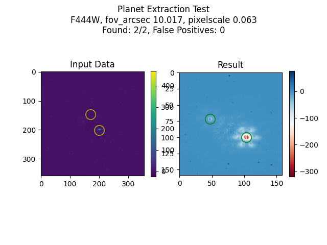

## JPL SIRI Project
Astrometry and Photometry Extraction Tool for Directly Imaging Exoplanets using James Webb Space Telescope NIRCam

### Run instructions

With pipenv: `pipenv shell`

Alternatively, `pip install` the packages in `Pipfile`

Example script: `python3 ./src/mc_test.py --amount 1 --file simulated_planets_20220419_124407.json`
> This runs the Monte-Carlo simulation on one planet in the json file.

Each script in /src folder can be run individually to test.